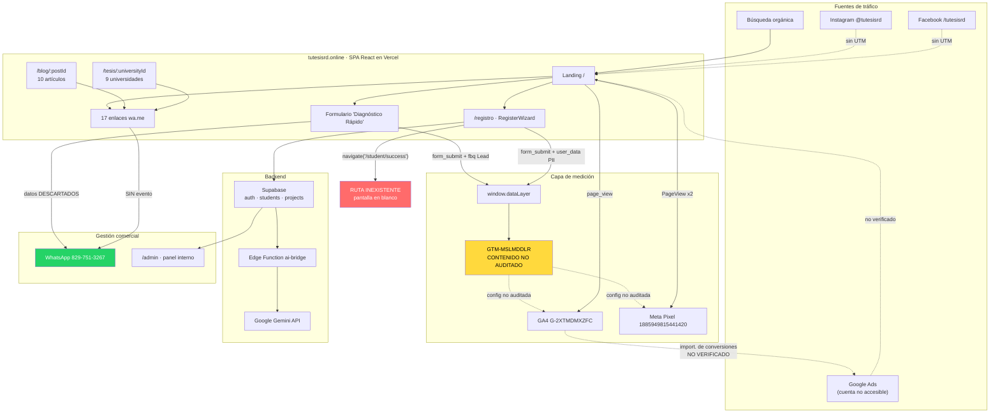

# 09 · Mapa de integraciones y flujo de datos

**Fecha:** 2026-07-31 · **Modo:** solo lectura

---

## A. Diagrama del flujo actual

Líneas continuas = verificado en código. Líneas punteadas = inferido o no verificable sin acceso.

---

## B. Rupturas del flujo de datos

Tres puntos donde la información se pierde de forma verificable:

| # | Punto de ruptura | Qué se pierde | Hallazgo |
|---|------------------|---------------|----------|
| 1 | `FORM → WA` | Etapa y nivel académico del estudiante: la información de calificación más valiosa del negocio | H-03 |
| 2 | `WA_LINKS → WA` | Toda la atribución: origen, campaña, página de partida | H-04 / H-23 |
| 3 | `REG → /student/success` | Confirmación al usuario, código de seguimiento, y la vista de gracias como señal de conversión | H-02 |

---

## C. Inventario de conexiones

| Origen | Destino | Tipo de dato | Método | Cuenta propietaria | Autenticación | Frecuencia | Estado | Riesgo | Recomendación |
|--------|---------|--------------|--------|--------------------|---------------|-----------|--------|--------|---------------|
| Web | GTM `MSLMDDLR` | Eventos, dataLayer | Script en `<head>` | Tu Tesis RD | — | Tiempo real | ✅ Activo | Contenido no auditado | Obtener acceso de lectura |
| Web | GA4 `G-2XTMDMXZFC` | `page_view`, `view_item`, `generate_lead` | gtag vía GTM | Tu Tesis RD | — | Tiempo real | ⚠️ Parcial | Posible duplicación de `page_view` | Auditar GTM |
| Web | Meta Pixel | `PageView`, `Lead`, `ViewContent` | `fbq` inyectado en runtime | Tu Tesis RD | — | Tiempo real | ⚠️ Con defectos | PageView duplicado; `Lead` falso | H-05, H-03, H-06 |
| Web | Supabase | PII: email, teléfono, nombre; datos de proyecto e importes | SDK `@supabase/supabase-js` con anon key | Tu Tesis RD | Anon key + RLS | Por evento | ✅ Activo | RLS **no verificado**; sin antispam | Auditar políticas RLS |
| Supabase | Edge Function `ai-bridge` | Texto de tesis (hasta 500 k caracteres) | Invocación HTTP `--no-verify-jwt` | Tu Tesis RD | **Sin verificación de JWT** | Por uso | ⚠️ Abierto | Endpoint invocable sin autenticación → abuso de cuota de IA | Añadir rate limiting |
| Edge Function | Google Gemini API | Contenido íntegro de tesis de usuarios | HTTPS + API key en Supabase Secrets | Tu Tesis RD | Secret gestionado | Por uso | ✅ Correcto | Documento académico completo a un tercero | Declararlo en la política de privacidad |
| GA4 | Google Ads | Importación de conversiones | Vinculación nativa | ❓ | — | Diaria | ❓ **No verificado** | Riesgo de doble conteo con conversiones nativas | Verificar al obtener acceso |
| Git | GitHub | Código + `.mcp.json` con token | `git push` | `cordero0012` | HTTPS | Por commit | 🔴 **Secreto expuesto** | Token de desarrollador de Ads en el historial | **H-01 — rotar** |
| Git | Vercel | Despliegue automático | Integración Git | Tu Tesis RD | OAuth | Por push a `main` | ✅ Activo | 13 archivos sin commitear (H-13) | Sincronizar |
| **ADC local** | **Google Ads + GA4 + Supabase** | **Credenciales de API** | **`application_default_credentials.json` global** | **NES CAMP** | **OAuth (ADC compartido)** | Continuo | 🔴 **Conflicto** | **Identidad única compartida entre organizaciones** | **H-00 — ver `10_separacion_nes_camp.md`** |

---

## D. Integraciones que dependen de la sesión de NES CAMP

Marcadas explícitamente, según pedía la Fase 6:

| Integración | Dependencia | Consecuencia |
|-------------|-------------|--------------|
| MCP `google-analytics` | `GOOGLE_APPLICATION_CREDENTIALS` → ADC global de NES CAMP | Solo lista `NES CAMP – Web`. GA4 de Tu Tesis RD inaccesible |
| MCP `google-ads` | Mismo ADC + `login-customer-id` MCC `6869393137` de NES CAMP | Solo lista la cuenta `4456869415`. Ads de Tu Tesis RD inaccesible |
| MCP `supabase` | Token de la organización NES CAMP | Solo lista el proyecto `NES CAMP`. Supabase de Tu Tesis RD inaccesible |

**Ninguna de las tres puede reautenticarse para Tu Tesis RD sin destruir el acceso a NES CAMP**, porque el archivo ADC es único por usuario de Windows. Es la definición exacta del problema que el encargo pedía resolver, y la razón de que la solución recomendada pase por credenciales separadas por ruta y no por reautenticación.

---

## E. Conexiones ausentes que el negocio necesitaría

| Conexión | Estado | Consecuencia |
|----------|--------|--------------|
| CRM | ❌ No existe | Supabase actúa como base de datos, no como CRM. Sin embudo comercial, ni estados de lead, ni seguimiento |
| WhatsApp → CRM | ❌ No existe | Las conversaciones —el canal principal— no quedan registradas en ningún sistema |
| Email marketing | ❌ No detectado | Sin recuperación de leads no convertidos |
| Search Console → GA4 | ❓ No verificado | Sin visibilidad de consultas orgánicas dentro de GA4 |
| Conversions API de Meta | ❓ No verificado | Solo pixel de navegador: pérdida de señal por bloqueadores e iOS |
| Google Business Profile | ❓ No confirmado | Sin presencia en el mapa local de Higüey |
